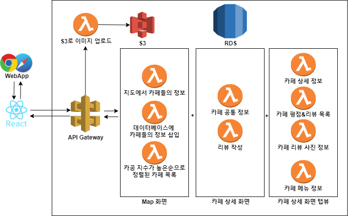
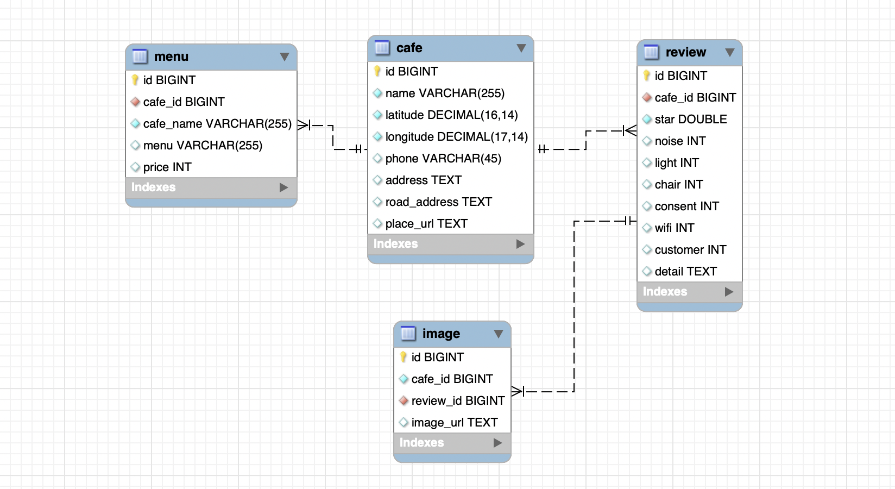

<h1 align="center">Welcome to cagong👋</h1>

<p align="center">

</p>

<br><br>

## ❓ What is cagong?

> 카공족이란? <br> 카페에서 커피나 간식 등을 구매하고 장시간 머무르며 공부하는 사람들을 말합니다.

**요즘 날씨도 더워지면서 카페에 공부하러오는 카공족들이 늘어나고 있습니다. 카공족들을 위해 동네나 학교 주변 카페에서 공부했던 사람들의 후기나 여담을 올리는 커뮤니티 만들어 봅시다!**

<br><br>

## 📌 Architecture

<p align="center">

</p>

<br><br>

## 📂 DB Modeling

<p align="center">

</p>

<br><br>

## 🚩 API 명세


<details>
<summary><b>[GET]  지도에서 카페들의 정보 조회 (인효)<b></summary>
<div markdown="1">       

<br>

100m 반경에 있는 카페 목록의 위도, 경도, 카페 이름을 반환합니다. <br>


```
[GET] /cafes?latitude=x&longitude=x
```

- **Response Body**

    ```json
    {
        "sucess": "true",
        "data": [
            {
                "id": "806447073",
                "place_name": "투썸플레이스 이대역점",
                "latitude": "37.5572360514845",
                "longitude": "126.94569812655"
            },
            {
                "id": "1866064248",
                "place_name": "카페봄봄 이화여대점",
                "latitude": "37.55722067043155",
                "longitude": "126.94555893119713"
            },
            {
                "id": "19622085",
                "place_name": "공차 이대점",
                "latitude": "37.5569764014276",
                "longitude": "126.945345206914"
            },
            {
                "id": "438330961",
                "place_name": "흑화당 이대점",
                "latitude": "37.5571243278597",
                "longitude": "126.945698207623"
            },
            {
                "id": "13127567",
                "place_name": "카페쥬디",
                "latitude": "37.5572832629733",
                "longitude": "126.946485798103"
            },
            {
                "id": "1595131797",
                "place_name": "커피베이 이대역점",
                "latitude": "37.55650794784634",
                "longitude": "126.945485885993"
            },
            {
                "id": "10368507",
                "place_name": "라바짜 이대점",
                "latitude": "37.5574344119916",
                "longitude": "126.946005822281"
            },
            {
                "id": "213867029",
                "place_name": "다인전통찻집",
                "latitude": "37.556443159523",
                "longitude": "126.945667012953"
            },
            {
                "id": "23040316",
                "place_name": "바카라",
                "latitude": "37.55606405286577",
                "longitude": "126.9461324344883"
            },
            {
                "id": "17811924",
                "place_name": "이지웨이 이대점",
                "latitude": "37.5572252103555",
                "longitude": "126.945634755837"
            }
        ]
    }
    ```

</div>
</details>

<details>
<summary><b>[GET] 카공지수로 정렬된 카페 리스트 조회 (인효)<b></summary>
<div markdown="1">   

<br>
새로운 페이지나 지도 옆에 슬라이드로 평점이 높은 까페 순으로 위도, 경도, 카페 이름 반환합니다. <br><br>


```
[GET] /cafes/sorted?latitude=12345678901234&longitude=12345678901234
```

- **Response Body**

    ```json
    {
        "sucess": "true",
        "data": [
            {
                "id": "806447073",
                "place_name": "투썸플레이스 이대역점",
                "latitude": "37.5572360514845",
                "longitude": "126.94569812655",
                "avg_star": 3.227272727272727
            },
            {
                "id": "1866064248",
                "place_name": "카페봄봄 이화여대점",
                "latitude": "37.55722067043155",
                "longitude": "126.94555893119713",
                "avg_star": "false"
            },
            {
                "id": "19622085",
                "place_name": "공차 이대점",
                "latitude": "37.5569764014276",
                "longitude": "126.945345206914",
                "avg_star": "false"
            },
            {
                "id": "438330961",
                "place_name": "흑화당 이대점",
                "latitude": "37.5571243278597",
                "longitude": "126.945698207623",
                "avg_star": "false"
            },
            {
                "id": "13127567",
                "place_name": "카페쥬디",
                "latitude": "37.5572832629733",
                "longitude": "126.946485798103",
                "avg_star": "false"
            },
            {
                "id": "1595131797",
                "place_name": "커피베이 이대역점",
                "latitude": "37.55650794784634",
                "longitude": "126.945485885993",
                "avg_star": "false"
            },
            {
                "id": "10368507",
                "place_name": "라바짜 이대점",
                "latitude": "37.5574344119916",
                "longitude": "126.946005822281",
                "avg_star": "false"
            },
            {
                "id": "213867029",
                "place_name": "다인전통찻집",
                "latitude": "37.556443159523",
                "longitude": "126.945667012953",
                "avg_star": "false"
            },
            {
                "id": "23040316",
                "place_name": "바카라",
                "latitude": "37.55606405286577",
                "longitude": "126.9461324344883",
                "avg_star": "false"
            },
            {
                "id": "17811924",
                "place_name": "이지웨이 이대점",
                "latitude": "37.5572252103555",
                "longitude": "126.945634755837",
                "avg_star": "false"
            }
        ]
    }
    ```

</div>
</details>


<details>
<summary><b>[GET] 카페 메인 정보 조회 (아영)<b></summary>
<div markdown="1">   

<br>
해당 카페의 메인 정보를 조회합니다. <br><br>


```
[GET] /cafes/{cafe-id}
```

- Response Body
    - 성공 1

        ```json
        // 21446374
        {
            "success": true,
            "data": {
                "id": 21446374,
                "name": "Take 10Cafe",
                "cnt_review": 21,
                "avg_star": 2.93,
                "avg_noise": 2.6,
                "avg_light": 2.3,
                "avg_chair": 1.9,
                "thumbnail": "https://~.png"
            }
        }
        ```

    - 성공 2

        ```json
        // 8119644
        {
            "success": true,
            "data": {
                "id": 8119644,
                "name": "프린세스다이어리",
                "cnt_review": 0,
                "avg_star": null,
                "avg_noise": null,
                "avg_light": null,
                "avg_chair": null,
                "thumbnail": "https://~.png"
            }
        }
        ```

    - 실패

        ```json
        {
            "success": false,
            "message": "카페 정보가 존재하지 않습니다."
        }
        ```

</div>
</details>


<details>
<summary><b>[GET] 카페 상세 정보 조회 (아영)<b></summary>
<div markdown="1">   

<br>
카페의 상세 정보를 조회합니다. (첫 번째 탭)<br>


```json
[GET] /cafes/{cafe-id}/info
```

- **Response Body**
    - **성공**

        ```json
        {
            "success": true,
            "data": {
                "id": 21446374,
                "name": "Take 10Cafe",
                "phone": null,
                "address": null,
                "latitude": 37.55764294352850,
                "longitude": 126.94492370288400,
                "avg_star": 2.85,
                "avg_noise": 2.6,
                "avg_light": 2.3,
                "avg_chair": 1.7,
                "avg_consent": 1,
                "avg_wifi": 2,
                "customer": 1,
                "review": "요호"
            }
        }
        ```

    - **성공 (카페 정보만 있는 경우)**

        ```json
        // 8119644
        {
            "success": true,
            "data": {
                "id": 8119644,
                "name": "프린세스다이어리",
                "phone": "012002",
                "address": "서울특별시 서대문구",
                "latitude": 37.55796784146020,
                "longitude": 126.94609145201600,
                "avg_star": null,
                "avg_noise": null,
                "avg_light": null,
                "avg_chair": null,
                "avg_consent": null,
                "avg_wifi": null,
                "customer": 2,
                "review": null
            }
        }
        ```

    - **실패 (카페 정보 자체가 DB에 없는 경우)**

        ```json
        {
            "success": false,
            "message": "카페 정보가 존재하지 않습니다."
        }
        ```

</div>
</details>


<details>
<summary><b>[GET] 카페 리뷰 목록 조회 (인효)<b></summary>
<div markdown="1">   

<br>
해당 카페의 리뷰 목록을 조회합니다. (두 번째 탭)<br>


```json
[GET] /cafes/{cafe-id}/reviews 
```

- **Response Body**

    ```json
    {
      "success": "true",
      "data": [
        {
          "star": 1,
          "detail": "요호"
        },
        {
          "star": 4.5,
          "detail": "성공이다"
        },
        {
          "star": 3.5,
          "detail": "다 좋지만 화장실이 별로다"
        },
        {
          "star": 2.5,
          "detail": "포스트맨 테스트"
        },
        {
          "star": 2.5,
          "detail": "포스트맨 테스트"
        },
        {
          "star": 2.5,
          "detail": "포스트맨 테스트"
        },
        {
          "star": 3.5,
          "detail": "다 좋지만 화장실이 별로다"
        },
        {
          "star": 3.5,
          "detail": "다 좋지만 화장실이 별로다"
        },
        {
          "star": 3.5,
          "detail": "다 좋지만 화장실이 별로다"
        },
        {
          "star": 4,
          "detail": "요호"
        },
        {
          "star": 4,
          "detail": "요호"
        },
        {
          "star": 3.5,
          "detail": "요호"
        },
        {
          "star": 1,
          "detail": "요호"
        }
      ]
    }
    ```
</div>
</details>


<details>
<summary><b>[GET] 카페 이미지 목록 조회 (아영)<b></summary>
<div markdown="1">   

<br>
해당 카페의 이미지들을 조회합니다. (세 번째 탭)<br>


```
[GET] /cafes/{cafe-id}/images
```

- **Response Body**
    - **성공**

        ```json
        {
            "success": true,
            "data": [
                "https://~.jpeg",
                "https://~.jpeg",
                "https://~.jpeg",
                "https://~.jpeg",
                "https://~.jpeg",
                "https://~.jpeg."
            ]
        }
        ```

    - **실패**

        ```json
        {
            "success": false,
            "message": "이미지 존재하지 않습니다."
        }
        ```

</div>
</details>


<details>
<summary><b>[GET] 카페 메뉴 조회 (아영)<b></summary>
<div markdown="1">  

<br>
해당 카페의 메뉴를 조회합니다. (네 번째 탭)<br>


```
[GET] /cafes/{cafe-id}/menus
```

- **Response Body**
    - **성공**

        ```json
        {
            "success": true,
            "data": [
                {
                    "menu": "돈코츠라멘",
                    "price": 6000
                },
                {
                    "menu": "카라귀라멘",
                    "price": 6000
                },
                {
                    "menu": "쯔케면",
                    "price": 6000
                },
                {
                    "menu": "쿠로 라멘",
                    "price": 6000
                },
                {
                    "menu": "안카케 야끼라멘",
                    "price": 6000
                }
            ]
        }
        ```

    - 실패

        ```json
        {
            "success": false,
            "message": "메뉴 정보가 존재하지 않습니다."
        }
        ```

</div>
</details>


<details>
<summary><b>[POST] 이미지 리스트 업로드 (아영) <b></summary>
<div markdown="1">   

<br>

리뷰 작성할 때, 이미지를 첨부하는 경우 API를 호출합니다. <br>
이미지 url 리스트를 받아 `리뷰 작성 API` 를 호출할 때 Request Body에 담습니다. <br>


<br>

```json
[POST] /images
```

- **Request Header**

    ```json
    {
        "Content-Type": "multipart/form-data"
    }
    ```

- **Request Body**

    ```json
    form-data file로 전송 
    key는 file로 설정
    ```

    예시

    

- **Response Body**

    이미지 url 리스트를 반환합니다.

    ```json
    {
        "success": true,
        "data": [
            "https://~.png",
            "https://~.png"
        ]
    }
    ```

</div>
</details>


<details>
<summary><b>[POST] 리뷰 작성 (아영)<b></summary>
<div markdown="1">   

<br>

id가 `{cafe-id}`인 카페의 카공 후기를 작성합니다.<br>


<br>

```
[POST] /cafes/{cafe-id}/reviews
```

- **Request Body**

    ```json
    {
    		"star": 3.5,
        "consent": 2,
    		"chair": 3,
    		"noise": 3,
    		"light": 2,
    		"wifi": 2,
    		"customer": 1,
    		"detail": "최고",
        "imageList": [
            "https://~.jpeg"  
        ]   
    }
    ```

- **Response Body**
    - **성공**

        ```json
        {
            "success": true
        }
        ```

    - **실패 (별점 없는 경우)**

        ```json
        {
            "success": false,
            "message": "별점 입력해주세요."
        }
        ```

</div>
</details>

<br><br>

## 📝 License

Copyright © 2021 [GDG-Summer-Hackathon-Group12](https://github.com/GDG-Summer-Hackathon-Group12).<br/>
This project is [MIT](https://github.com/GDG-Summer-Hackathon-Group12/serverless-backend/blob/main/LICENSE) licensed.
***
_This README was generated with ❤️ by [readme-md-generator](https://github.com/kefranabg/readme-md-generator)_