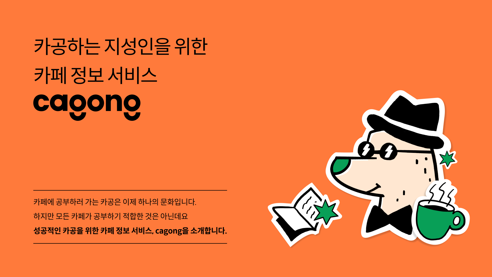

<h1 align="center">카공 커뮤니티 야!카공?👋</h1>

<p align="center">

</p>

<br><br>

## ❓ What is `야!카공?`

> 카공족이란? <br> 카페에서 커피나 간식 등을 구매하고 장시간 머무르며 공부하는 사람들을 말합니다.

**요즘 날씨도 더워지면서 카페에 공부하러오는 카공족들이 늘어나고 있습니다. 카공족들을 위해 동네나 학교 주변 카페에서 공부했던 사람들의 후기나 여담을 올리는 커뮤니티 만들어 봅시다!**

<br><br>

## 📌 Architecture

<p align="center">

</p>

<br><br>

## 📂 DB Modeling

<p align="center">

</p>

<br><br>

## 🚩 API 명세

### 지도에서 카페들의 정보 조회

* **GET /cafes?latitude=?&longitude=?**
  ```
  
  ```

### 카공지수가 높은 순으로 정렬된 카페 리스트 조회

### 카페 공통 정보 조회

### 카페 상세 정보 조회

### 카페 리뷰 목록 조회

### 카페 리뷰 사진 조회 

### 카페 메뉴 조회

### 리뷰 작성

### 이미지 리스트 업로드

<br><br>

## 🎈 Features

??


<br><br>

## 📝 License

Copyright © 2021 [GDG-Summer-Hackathon-Group12](https://github.com/GDG-Summer-Hackathon-Group12).<br/>
This project is [MIT](https://github.com/GDG-Summer-Hackathon-Group12/serverless-backend/blob/main/LICENSE) licensed.
***
_This README was generated with ❤️ by [readme-md-generator](https://github.com/kefranabg/readme-md-generator)_